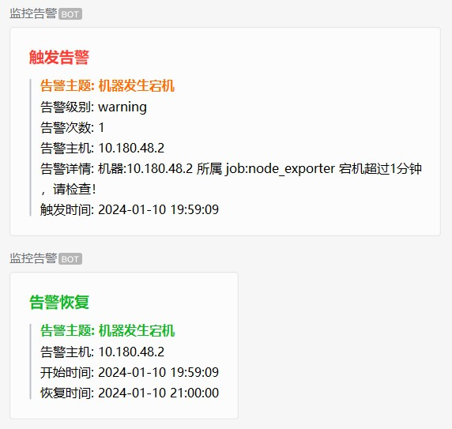
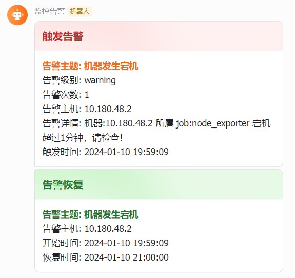
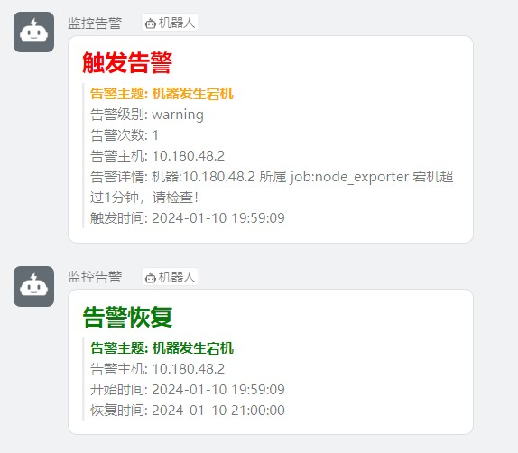

# alertmanager-webhook

## 项目说明
```
一个用于alertmanager转发告警信息到指定平台的webhook，适用于使用alertmanager作为告警工具的运维或者开发人员，也适用于自行开发告警平台的开发人员，告警信息转换成alertmanager的json告警格式即可。
```

## 功能特性
```
1. 支持自定义告警模板
2. 支持对接企业微信机器人
3. 支持对接飞书机器人
4. 支持对接钉钉
```


## 使用用法
**项目依赖redis，需要先启动redis**

**1. 二进制启动**

下载二进制文件，修改 alertmanager-webhook.yaml
```bash
./alertmanager-webhook -c alertmanager-webhook.yaml
```
**2. docker启动**
```bash
docker run -d --name redis -v /root/redis.conf:/etc/redis/redis.conf -p 0.0.0.0:6381:6379 redis:5.0.0 redis-
server /etc/redis/redis.conf
docker run --name alertmanager-webhook -p 0.0.0.0:9095:9095-v ./alertmanager-webhook.yaml:/etc/alertmanager-webhook alertmanager-webhook:v1.0
```

## 告警配置

alertmanager中配置webhook

```yaml
# alertmanager.yml
......

receivers:
  name: webhook
  webhook_configs:
  # 配置企业微信接口
  - url: 'http://127.0.0.1:9095/qywechat'
  # 配置飞书接口
  - url: 'http://127.0.0.1:9095/feishu'
  # 配置钉钉接口
  - url: 'http://127.0.0.1:9095/dingding'

......
```

## 使用示例
**使用curl模仿alertmanager往webhook发送消息**

```bash
curl -X POST -H "Content-Type: application/json" -d '
{"alerts": [
    {
      "status": "resolved",
      "labels": {
        "alertname": "机器宕机监测",
        "instance": "10.180.48.2",
        "job": "node_exporter",
        "serverity": "warning"
      },
      "annotations": {
        "description": "机器:10.180.48.2 所属 job:node_exporter 宕机超过1分钟，请检查！",
        "summary": "机器发生宕机"
      },
      "startsAt": "2024-01-10T11:59:09.775Z",
      "endsAt": "2024-01-10T13:00:00Z",
      "fingerprint": "02f13394997e5211"
    }
  ]
}' 127.0.0.1:9095/<qywechat|feishu|dingding>

# 注意<qywechat|feishu|dingding> 从中选择一个，比如企业微信就是：127.0.0.1:9095/qywechat
```

## 实现效果
**企业微信告警效果**



**飞书告警效果**



**钉钉告警效果**


